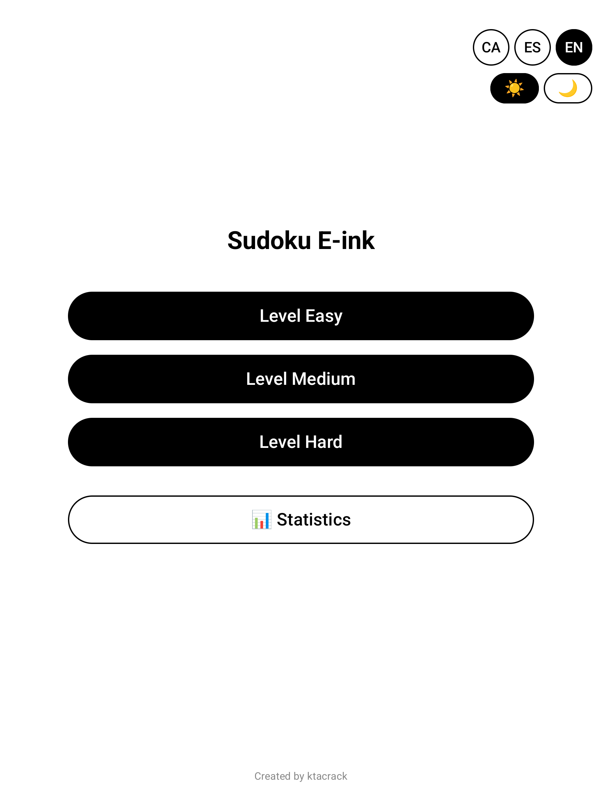
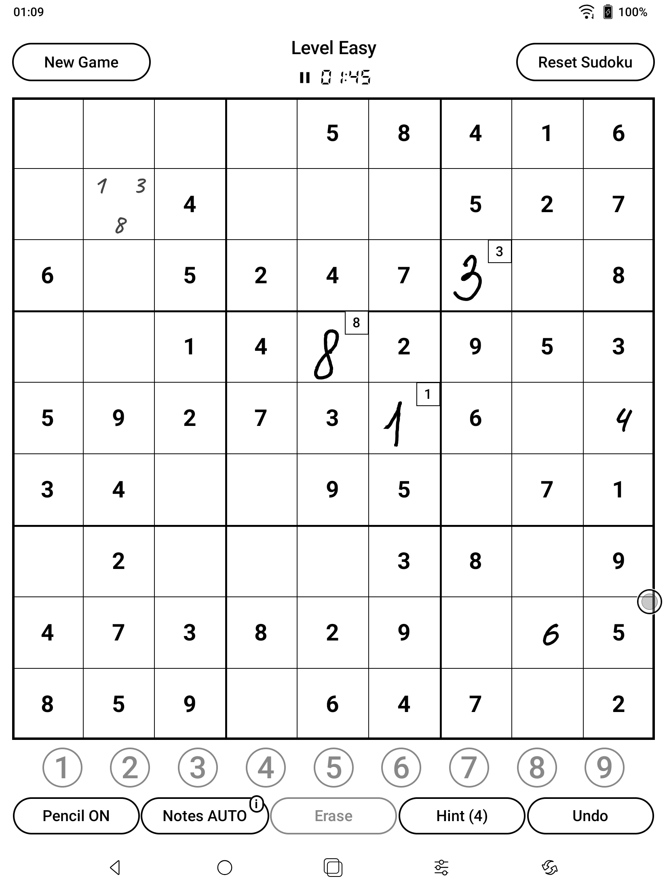
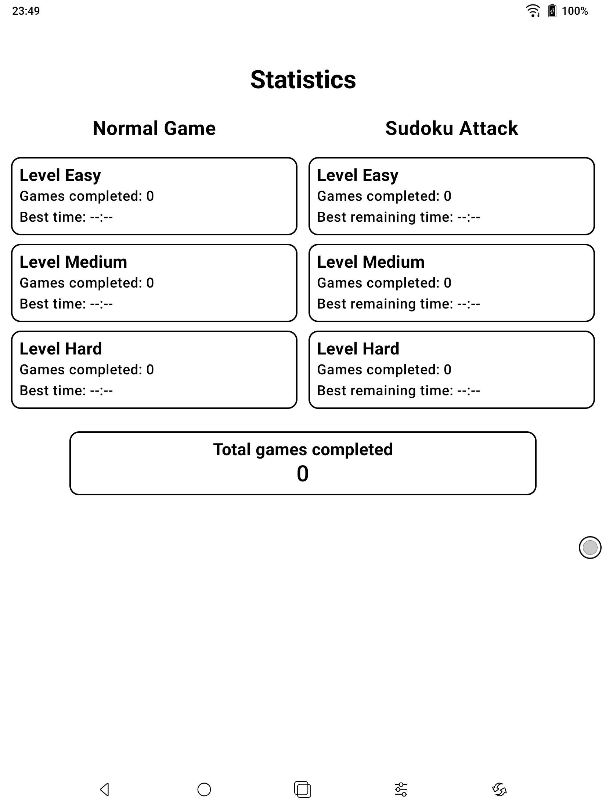

# Sudoku E-ink


**🌍 Languages / Idiomes:** [Català](README.md) | [English](README.en.md)

---

⚠️ **Official Repository**

This is the only official repository for Sudoku E-ink. Only download the app from here or from verified releases. Any fork or copy may contain unauthorized modifications.

---

🔒 **Author:** ktacrack  
📄 **License:** MIT License  
🔗 **Official URL:** [https://github.com/ktacrack/SudokuEink](https://github.com/ktacrack/SudokuEink)

---

## Features

### 🎮 Gameplay
- **3 difficulty levels:** Easy, Medium, and Hard
- **Smart Sudoku generator** with optimized algorithms
- **Hint system** limited by difficulty (5/3/1)
- **Notes mode** to mark possible numbers
- **Undo moves** with unlimited history
- **Reset game** at any time

### ⏱️ Timer and Game Management
- **Timer with controls:** pause, resume, and restart time
- **Independent saved games** for each difficulty level
- **Auto-save** when exiting the game
- **Automatic recovery** of games in progress

### ✏️ Handwriting Recognition
- **Global pencil mode** for quick recognition
- **Handwritten digit recognition** with TensorFlow Lite
- **Adaptive scaled drawing canvas** for all screen types
- **Perfect integration** with notes mode

### 📊 Statistics
- **Completed games** per difficulty
- **Best time** recorded for each level
- **Persistent history** of results

### 🎨 Optimized for E-ink
- **High contrast design** specific for electronic ink displays
- **Clear visual differentiation:** fixed numbers (black + bold) vs user (gray + light)
- **Optimized colors** for black and white
- **Differentiated cell backgrounds** for better readability
- **Clean interface** without distractions

### 📱 Adaptive Experience
- **Smart scaling** for all screen types (phones, tablets)
- **Adaptive layout:** vertical for phones, horizontal for tablets
- **Optimized controls** for each screen size
- **Proportionally scaled buttons** to device

### 🌍 Multilingual
- **Català** (CA)
- **Español** (ES)
- **English** (EN)

## Installation

### Option 1: From Releases
1. Download the APK from [Releases](https://github.com/ktacrack/sudokueink/releases)
2. Install the APK on your e-ink device (Boox, Kindle, etc.)
3. Open the app and start playing!

### Option 2: Build from source
1. Clone the repository
```
bash
git clone https://github.com/ktacrack/sudokueink.git
cd sudokueink
```
2. Open the project with Android Studio
3. Build and install on your device

## Requirements
- Android 8.0 (API 26) or higher
- E-ink display recommended (works on any screen)
- ~15 MB of free storage

## Screenshots
<p>
  
  
  
</p>

## Development
**Technologies used:**
**Language:** Kotlin
**UI Framework:** Jetpack Compose
**AI:** TensorFlow Lite (Sudoku generation)
**Minimum SDK:** Android 26 (Oreo)
**Recommended IDE:** Android Studio

## Project structure:
```sudoku-eink/
├── app/
│   └── src/
│       └── main/
│           ├── java/com/ktacrack/sudokueink/
│           │   ├── ui.theme/
│           │   │   ├── Color.kt
│           │   │   ├── Theme.kt
│           │   │   └── Type.kt
│           │   ├── MainActivity.kt
│           │   ├── MainScreen.kt
│           │   ├── GameScreen.kt
│           │   ├── GameState.kt
│           │   ├── StatisticsScreen.kt
│           │   ├── Statistics.kt
│           │   ├── StatisticsManager.kt
│           │   ├── SudokuGenerator.kt
│           │   ├── SudokuGame.kt
│           │   ├── Strings.kt
│           │   ├── Navigation.kt
│           │   ├── DrawingCanvas.kt
│           │   ├── DigitRecognizer.kt
│           │   ├── AdaptiveSizes.kt
│           │   ├── EinkOptimizations.kt
│           │   └── ThemeManager.kt
│           ├── res/
│           │   └── mipmap/
│           │       ├── ic_launcher.png
│           │       └── ic_launcher_round.png
│           ├── assets/
│           │   └── mnist.tflite
│           └── AndroidManifest.xml
├── gradle/
├── images/
│   ├── Menu_catala.png
│   ├── Menu_english.png
│   ├── Joc_catala.png
│   ├── Joc_english.png
│   ├── Stats_catala.png
│   └── Stats_english.png
├── .gitignore
├── build.gradle.kts
├── settings.gradle.kts
├── LICENSE
├── CHANGELOG.md
├── README.md
└── README.en.md
```

## How to play
1. **Select difficulty:** Easy, Medium or Hard
2. **Fill the grid:** Tap an empty cell and write down or select a number
3. **Complete the Sudoku:** Win when correctly filled!
4. **Check statistics:** Review your progress and best time

## Contributing
Contributions are welcome! If you want to improve the app:
1. Fork the repository
2. Create a branch for your feature (git checkout -b feature/new-feature)
3. Commit your changes (git commit -m 'Add new feature')
4. Push to the branch (git push origin feature/new-feature)
5. Open a Pull Request

## License
This project is licensed under the MIT License. See the LICENSE file for details.
You are free to use, modify and distribute this code, as long as you maintain attribution to the original author.

## Contact
- **Author:** ktacrack
- **GitHub:** @ktacrack

## Acknowledgments
Developed to provide an optimized Sudoku experience for e-ink devices, with a clear interface and high contrast.

### ⭐ If you found it useful, leave a star on the repository!
